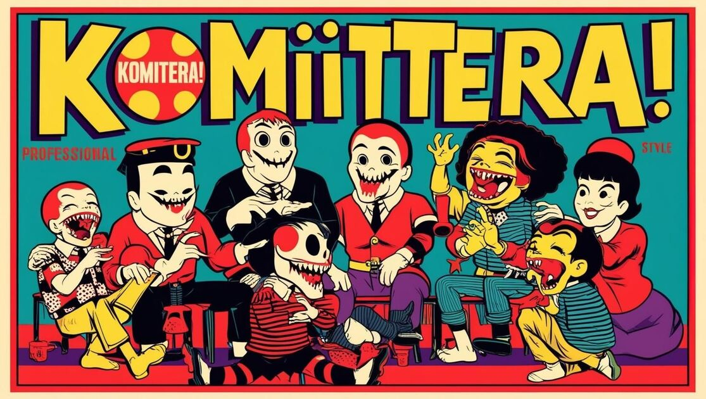

# プロジェクト名：『こみてらっ！』

サービスURL[こみてら.com](https://xn--28jvb3dvb.com)

# 目次
- [サービス概要](#サービス概要)
- [サービスURL](#サービスurl)
- [サービス開発の背景](#サービス開発の背景)
- [機能紹介](#機能紹介)
- [技術構成について](#技術構成について)
  - [使用技術](#使用技術)
  - [ER図](#er図)
  - [画面遷移図](#画面遷移図) 
 

# サービス概要

怖くないB級ホラー映画紹介を中心としたレビューアプリです。
ホラー映画を観た事がないユーザー向けに映画のハードルを下げるためのアプリです。
ホラー映画を見たことがあるユーザーは普段観ない作品を見つける事ができます。

# サービスURL
サービスURL[こみてら.com](https://xn--28jvb3dvb.com)

# サービス開発の背景
初心者向けホラー映画で紹介される作品は多くても10作品ほどしかなく、もっと沢山知りたいと思ったからです。

私自身、ホラー映画は怖いから見たくないと思ってました。
しかし、マリグナントという作品を観てその考えは変わりました。
怖いのは冒頭くらいで殆どアクション映画でホラー要素はあまり関係無かったのです。
私が身構え過ぎて勝手に敷居を高くしていた事を自覚しました。
そして、もっと他の作品を観てみたいと思いホラー映画にハマっていきました。

私の経験を元に身構えすぎずホラー映画の楽しさや非日常のスリルを味わって欲しいと感じたからです。
映画は観るけどホラー映画は観ないという方が多く見受けられたため、そんな方の初めて観る1本になれたらと思います。

# ユーザー層について
映画好きだが、ホラー映画は苦手意識があって見た事ない人
↓
このアプリでは怖い映画を紹介していないので、安心して観ることができる

恋愛映画やよくあるアクション映画で満足できなくなった人
↓
主人公でさえ死ぬかもしれないというスリルでマンネリした展開を打破する事ができる

日本は平和だと思い込んでいる人
↓
絶対に安全な状況から恐怖体験をする事で、自分もいつ、どこで死ぬのか分からないという不安を煽り防犯意識の向上と日々の感謝を促す。

# 💻 機能紹介

# 技術構成について

### 画面遷移図
Figma：https://www.figma.com/design/j8l654IioatkAUz10JWezL/%E3%81%93%E3%81%BF%E3%81%A6%E3%82%89%E3%81%A3%EF%BC%81?node-id=0-1&node-type=canvas&t=rqjJpxqFSBs8SmYo-0

### ER図

